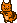

Crypto Collectibles Series -
[Cats](https://github.com/cryptocopycats/design.mooncats) ·
[Punks](https://github.com/cryptopunksnotdead/design.punks)


# Mooncat Design Series

## Original MoonCatRescue Series (~24×24) - 128 Designs

All 128 designs in original pixel size.

Note: The pixel size depends on the pose:
standing (21×17), sleeping (20×14), pouncing (17×22), stalking (20×21)


For more see [**original »**](original)


## V2 Series (~24×24) -  8 Designs

Let's change the nose and mouth to use the outline (color #1).
Let's change color #5 into the (exclusive) eyes color
by adding a pixel each to the eyes
and changing all other color #5 pixels to color #4.
Can you spot the difference?





What's the point?
It's "L'art pour L'art" or in English "Art for Art's Sake" :-).

Almost. The idea of the new v2 design series is to make
it easier to colorize Mooncats. The new color scheme:

- #1 - outline color
- #2 - pattern 1 (or highlight) color
- #3 - base color
- #4 - pattern 2 (or accent) color
- #5 - eyes color

For more see [**v2 »**](v2)


## Original CryptoCats Series (32×32) - 4 Designs

Let's keep the V2 color scheme
and cross-over to CryptoCats.

Note: The designs in the original MoonCatRescue series
only use 5 colors (plus transparent).
As a new convention lets add two more "hard-coded" always pre-defined / present colors:

- #6 - BLACK (`000000`)
- #7 - WHITE (`ffffff`)

Let's try:


For more see [**cryptocats »**](cryptocats)


## Tools

###  Do-It-Yourself (DIY) Corner - Yes, You Can! - Draw Your Own Free Cats (In 24x24 Or 32x32) That You Own 100% Forever


Try the Cat Pixel Drawing Tool online
=> [**https://cryptocopycats.github.io**](https://cryptocopycats.github.io/)

How does it work?

A little tip if you try it out online - there are [128 original mooncat pixel drawings / designs](https://github.com/cryptocopycats/awesome-mooncatrescue-bubble/blob/master/DESIGNS.md)
(all encoded in the original source code in a single-line string - see [`designs.rb`](https://raw.githubusercontent.com/cryptocopycats/mooncats/master/mooncats/lib/mooncats/designs.rb) for a "word-wrapped" more readable
source of the original example.

Yes, you can read in any design into the pixel drawing tool online.
Example for [design 0](original/000.txt):


```
. . @ . . . . . @ . . . . . . . . . . . .
. @ o @ . . . @ o @ . . . . . . . . . . .
. @ ~ o @ @ @ o ~ @ . . . . . . . . . . .
@ @ o o o o o o o @ @ . . . . . . @ @ @ .
@ o o o o o o o o o @ . . . . . . @ o @ .
@ o o @ o o o @ o o @ @ @ @ @ @ . @ @ o @
@ o o o o o o o o o @ o o o o @ @ . @ o @
@ o o ^ o ~ o ^ o o @ o o o o o @ . @ o @
@ o o o ^ o ^ o o o @ o o o o o @ @ @ o @
. @ o o o o o o o @ o o o o o o o o o @ @
. . @ @ @ @ @ @ @ o o o o o o o o @ @ @ .
. . @ o o o o o o o o o o o o o o @ . . .
. . @ o o o o o @ ^ ^ ^ @ o o o @ @ . . .
. . . @ o o @ o o @ ^ @ o o o @ @ . . . .
. . . . @ o @ @ o @ ^ @ o o @ @ . . . . .
. . . . @ ~ @ @ ~ @ @ ~ o @ @ . . . . . .
. . . . @ @ @ @ @ @ @ @ @ @ . . . . . . .
```

Paste the text into the box below the pixel grid canvas and click on the read button.
Now you should see the mooncat pixel design.


And for some more fun here's the [design 3](original/003.txt) reformatted - ready to copy'n'paste:

```
. . . . . . . . . . @ @ @ @ @ @ . . . .
. . . . . . . . . . @ o o o o @ @ @ . .
. . . . . . . . . . @ o @ @ o o o @ . .
. . . . . . . . . . @ @ . . @ @ o @ . .
. . . . . . . . . . . . . . . @ o @ @ .
. . . . . . . . . . . . . . . @ o o @ .
. . @ @ . . . . @ @ . . . @ @ @ @ @ @ .
. @ o @ . . . @ o @ . . @ @ o o o o @ @
@ o ~ o @ @ @ o ~ o @ @ @ o o o o o o @
@ o o o o o o o o o @ @ o o o o o o o @
@ o o o o o o o o o @ o o o o o o o o @
@ o o @ o o o @ o o @ o o o o o o o @ @
@ o o o o o o o o o @ o o o o o o o @ .
@ o o ^ o ~ o ^ o o @ o o o o ^ o o @ .
@ o o o ^ o ^ o o o @ o o ^ ^ ^ o o @ .
. @ o o o o o o o @ @ o ^ ^ ^ @ o o o @
. . @ @ @ @ @ @ @ o o o @ @ @ @ @ o o @
. @ @ o o o o o o o @ @ @ o o @ @ o @ @
@ @ o o o @ o o @ @ @ @ ~ o @ @ o o @ .
@ ~ o @ @ @ ~ @ @ . . @ @ @ @ ~ o @ @ .
@ @ @ @ . @ @ @ . . . . . . @ @ @ @ . .
```


## Questions? Comments?

Post them on the [mooncatrescue reddit](https://old.reddit.com/r/mooncatrescue). Thanks.

